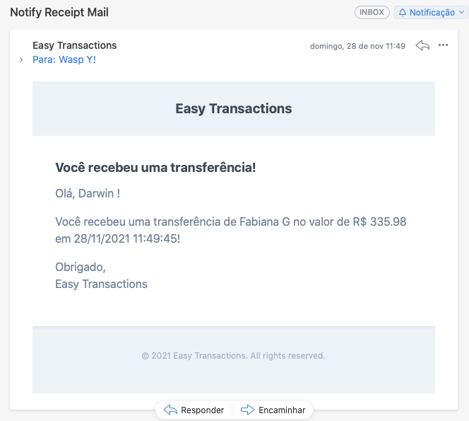

# Easy Transactions
## API de Transferências e cadastro de Usuários

API feita na linguagem PHP com uso do Framework Laravel e banco de dados MySQL.<br>
- PHP 7.3.11
- Laravel 8.73.2
- MySQL 5.7.26
- Servidor Nginx 1.21.3

Dentre as funcionalidades do sistema, temos:
- gerenciamento de usuários (cadastro, atualização, remoção, listagem e consultas);
- realização de transferência financeira entre dois usuários, seguindo algumas regras, como, por exemplo: usuário do tipo lojista apenas recebe, não transfere; só pode transferir se tiver saldo e após aprovação de consulta a sistema externo.
<br>
  
Neste sistema foram implementados alguns **Design Patterns**, como: *Chain of Responsibility*, na cadeia de validações prévias pelas quais os dados da transferência passam antes desta poder ser realizada. Outro pattern que pode ser citado é o *Strategy*, utilizado em vários pontos, como, por exemplo, ao estabelecer algumas regras para se criar entidades, permitindo que cada uma implemente o método da forma que precisar, mas garantindo que todas as entidades tenham a referida função por meio do "contrato" da interface usada.<br>
<br>
No desenvolvimento desta API, buscou-se, também, manter uma arquitetura/estrutura mais "limpa", a fim de permitir que se altere, com mais facilidade, as regras de negócio do banco de dados, caso haja necessidade de mudanças futuras.
<br>

----

## How to Use

### Ambiente

É necessário possuir o Docker e o Docker-compose na máquina que executará a aplicação.<br>

- Copiar o arquivo `.env.example` e renomeá-lo para `.env`, a fim de termos as configurações de conexão de banco de dados.<br>

**Com Make:**<br>
- Executar, na pasta do projeto, o comando  `make prepare-environment`.<br>
Este comando já inicializará os containers da aplicação, instalará o que for necessário pelo composer, e prepará o banco de dados, executando as migrations e populando as tabelas users e wallets com alguns seeders para facilitar os testes.<br>
*Para outros atalhos de comandos, consultar os arquivo `Makefile`*<br>
Após a primeira inicialização, podemos passar a subir o sistema usando o comando `make start` (não vai rodar os seeders mais, sobe os containers e atualiza as migrations). 
<br>

**Sem o Make:**<br>
- Executar o comando `docker-compose up -d` para iniciar o ambiente.
- Rodar o comando `docker exec transaction-app php artisan migrate` para inicializar as tabelas do banco de dados dentro do container.
- Caso seja interessante, pode-se rodar os seeders para criar alguns usuários/carteiras de exemplo, com o seguinte comando `docker exec transaction-app php artisan db:seed UserSeeder` e `docker exec transaction-app php artisan db:seed WalletSeeder`.
No entanto, os usuários podem ser criados/gerenciados manualmente por meio de requisições às rotas específicas, como será explicado mais abaixo.
<br>

```
* A API usará a porta 8000 do localhost;
* O PHP MyAdmin estará na porta 8002.
```
<br>

----

### Requests
Para testarmos as rotas, podemos importar o exemplo de requisições (json presente na pasta `/anexos/requests-example`) para o Postman com o comando `command + O` ou `ctrl + O`, para facilitar.<br>
Para realizar requisições para a API, podemos seguir as instruções abaixo para cada uma das rotas:

#### *Rotas de Transação*

- **POST** -> `/api/transaction`<br>
Cria uma nova transação.<br>
Payload (form-data)
```
{
    "payer_id":1,
    "payee_id":2,
    "value":120.80
}
```
<br>

- **GET** -> `/api/transaction`<br>
Lista todas as transações para consulta.
<br>

#### *Rotas de Usuário*
- **GET** -> `/api/user`<br>
Retorna todos os usuários cadastrados
<br>


- **GET** -> `/api/user/1`<br>
Retorna os dados do usuário cujo ID tenha sido passado como parâmetro ao endpoint
<br>


- **POST** -> `/api/user`<br>
Insere um novo usuário.<br>
Payload (form-data)
```
{
    "name":"Hanzo Shimada",
    "email":"hanzo@overwatch.com",
    "password": 1234,
    "cpf_cnpj":123456789,
    "shopkeeper:0
}
```
<br>

- **PUT** -> `/api/user`<br>
Atualiza os dados do usuário.<br>
Payload (x-www-form-urlencoded)
```
{
    "id":3
    "name":"Hanzo Shimada",
    "email":"hanzo@overwatch.com",
    "password": 1234,
    "cpf_cnpj":123456789,
    "shopkeeper:0
}
```
<br>

- **DELETE** -> `/api/delete/3`
Remove o usuário do banco de dados.<br>
<br>


**PS:** Foi adicionado o header 'X-Requested-With': 'XMLHttpRequest' nas requisições para que fosse possível visualizar as mensagens de erro pelo Postman, visto que o Laravel, em caso de erro, estava apenas redirecionando para a view do index, sem mostrar a resposta e o status code. 

----

### Notificação
Caso a transação ocorra com sucesso, uma notificação será enviada ao usuário beneficiário.<br>
A forma de notificação foi implementada de duas formas:
- requisitando para uma url de Mock, cujo retorno é um json com "message":"success" (para isso, podemos descomentar a chamada que faz essa solicitação dentro de `TransactionService.notifyTransactionPayee()`);
- ou, enviando um e-mail real para o endereço de cadastro do usuário, enviando alguns dados para informar o usuário.
Esta segunda opção requer que se configure um e-mail no arquivo `.env` que servirá para disparar os e-mails do sistema aos usuários (no arquivo `.env.example` foi adicionada uma sugestão de configurações de cadastro para contas do GMail).
<br>

**Exemplo**<br>
Após uma transação realizada com sucesso, o usuário que recebeu a transferência recberá um e-mail como este:


